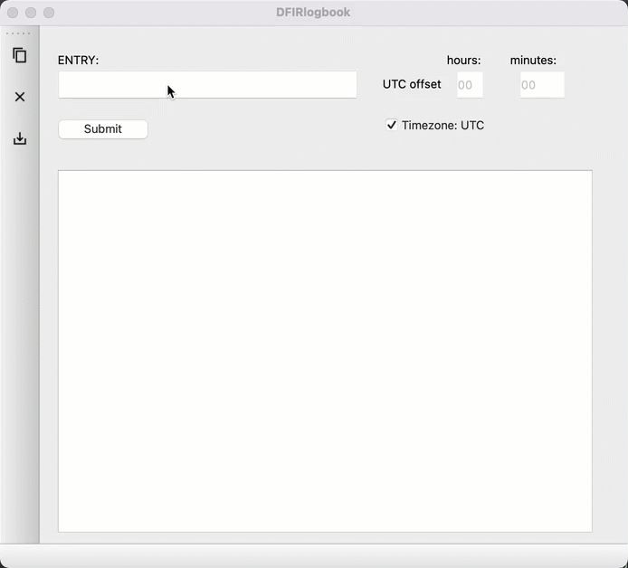

# DFIRlogbook
Logbook for Digital Forensics and Incident Response

## Overview
This project will help to better standardize the chronological record keeping associated with a period in a simple and easily accessible manner.

### Version 0.4.2.1
Added:
- output autoscroll
- screenshot support with MacOS Retina screen compatability
- screenshots are autonamed with the datestamp and placed in a local screenshots directory
- PDF save functionality with inline screenshot inclusion
