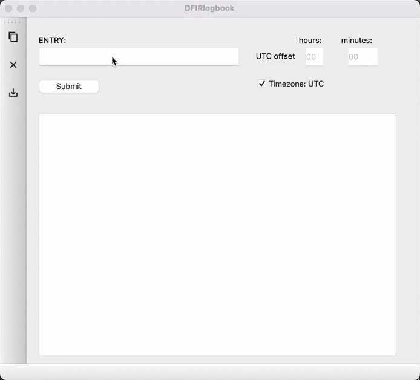

# DFIRlogbook
Logbook for Digital Forensics and Incident Response

## Overview
This project will help to better standardize the chronological record keeping associated with a period in a simple and easily accessible manner.

Rewrote GUI to PySide6 instead of tkinter. added a toolbar. added ability to specify a custom timezone offset.

**tkinter_basic.py has been moved to the archived folder 'DFIRlogbook_basic'. 

## Releases
GitHub Releases now auto-build binaries for:
- Windows
- Linux
- macOS

### Running the unsigned macOS binary
Because the macOS binary is unsigned, Gatekeeper may block it the first time you open it.

Option 1 (recommended):
1. Control-click (or right-click) the app/binary.
2. Select **Open**.
3. Click **Open** again in the security prompt.

Option 2 (Terminal):
1. Remove quarantine from the downloaded binary:
   `xattr -d com.apple.quarantine ~/Downloads/DFIRlogbook-macos-arm64`
2. Ensure it is executable:
   `chmod +x ~/Downloads/DFIRlogbook-macos-arm64`
